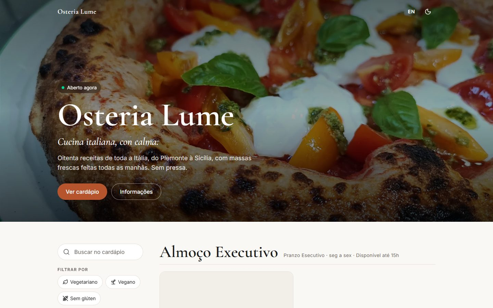
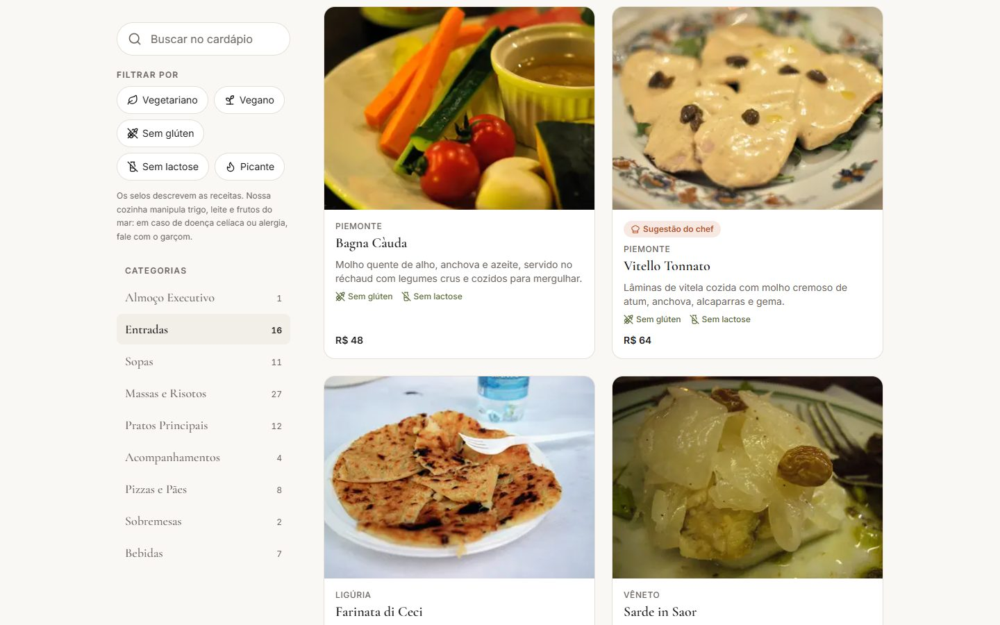
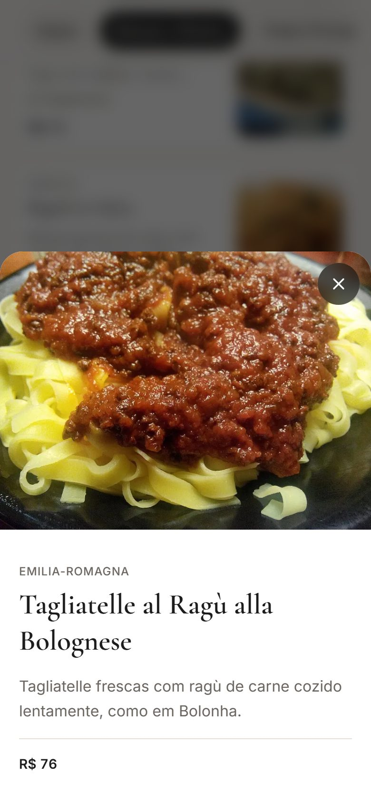
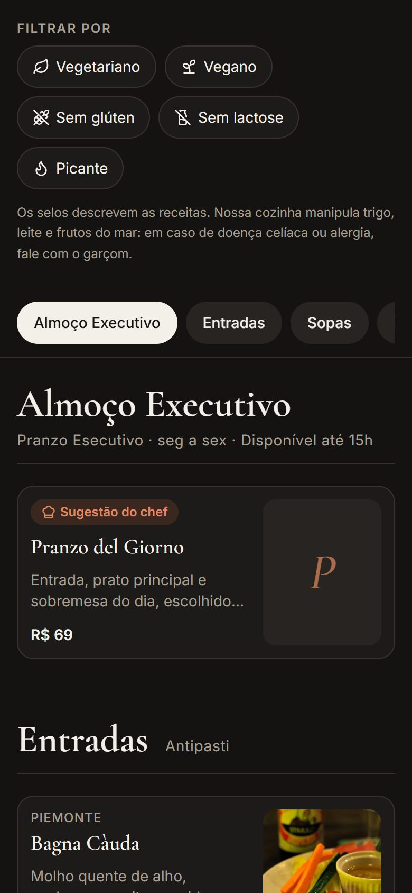

[← Voltar ao portfólio](README.md)

[🧪 Projetos fictícios](#-projetos-fictícios) · [🏢 Projetos reais](#-projetos-reais)

---

## 🧪 Projetos fictícios

> [!NOTE]
> **Estes projetos são fictícios.** Foram criados por mim para estudo e para demonstrar o meu trabalho. O restaurante e os dados mostrados não existem, e nenhum deles foi feito para um cliente.

| Projeto | Tipo | Status | Tecnologias | Links |
|---|---|:---:|---|---|
| 🍝 [**Osteria Lume**](#-osteria-lume) | Cardápio digital · Restaurante | 🟢 Demonstração no ar | Next.js 16 · TypeScript · Tailwind 4 | [Ver online](https://osteria-lume.vercel.app) · [Código](https://github.com/AkiraLeco/osteria-lume) |
| 🩸 [**Glicolog**](#-glicolog) | Sistema web · Saúde | ✅ Concluído | Next.js 16 · Supabase · Playwright | [Código](https://github.com/AkiraLeco/glicolog) |

### 🍝 Osteria Lume

  

Cardápio digital de um **restaurante italiano fictício**, feito para o cliente que chega pelo QR Code da mesa. Funciona em qualquer tela, com prioridade para o celular.

  

  
  
  

**Destaques**
- 80 pratos regionais italianos com foto, região de origem, preço e selos (vegano, sem glúten, picante…)
- Busca por nome ou ingrediente que ignora acentos, e filtros por selo
- Almoço executivo que só aparece em dias úteis, no horário do almoço (fuso de São Paulo)
- Português e inglês, com o idioma escolhido automaticamente pelo navegador
- Tema claro e escuro, indicador de "Aberto agora" e horário de funcionamento
- Páginas estáticas com imagens otimizadas, rápidas até em conexão móvel

   

### 🩸 Glicolog

  

Diário web de glicemia e insulina para pessoas com diabetes tipo 1, com conta própria, gráficos e importação de planilhas. **Projeto de estudo:** não é um produto em uso e não substitui orientação médica.

  
  

  

**Destaques**
- Conta com confirmação por e-mail, recuperação de senha e exclusão de todos os dados
- Registro rápido com a classificação da glicemia aparecendo enquanto o valor é digitado
- Gráficos de 1, 7 ou 30 dias com faixa-alvo personalizável
- Importação de CSV com pré-visualização e sem duplicar registros
- **Acessibilidade:** zero violações WCAG 2.2 AA e paleta validada para daltonismo
- **Privacidade (LGPD):** cada conta só vê os próprios dados (Row Level Security)
- **Testes:** ~100 testes unitários e ~85 de ponta a ponta em 3 tamanhos de tela

     

---

## 🏢 Projetos reais

> [!TIP]
> **Sites feitos para clientes e negócios de verdade.** Ainda não há nenhum publicado aqui. Os próximos tipos de site que quero fazer:

| Tipo | Para quem |
|---|---|
| 💈 Site institucional | Barbearias |
| 🏋️ Site institucional | Academias |
| 💪 Portfólio profissional | Personal trainers |
| 💄 Site institucional | Estética e beleza |
| 🚀 Landing page | Negócios locais em geral |

**Quer que o seu negócio seja o primeiro desta lista?**

---

[← Voltar ao portfólio](README.md)

